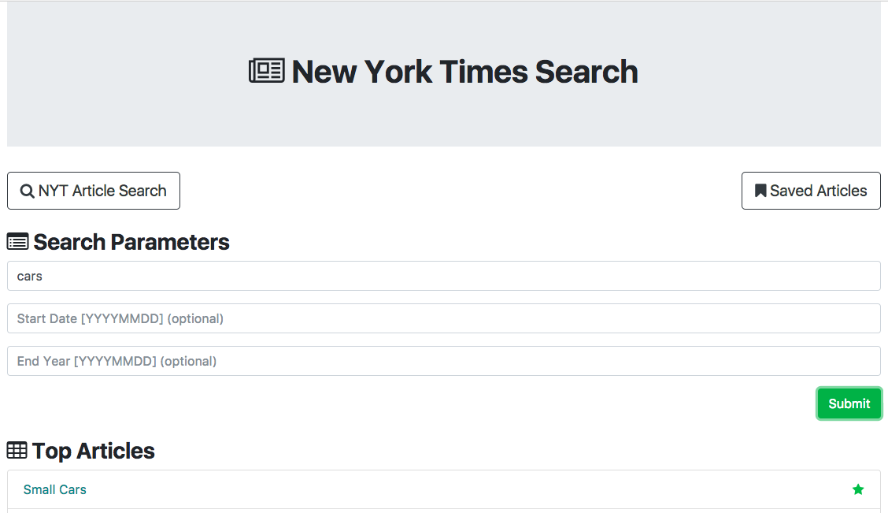
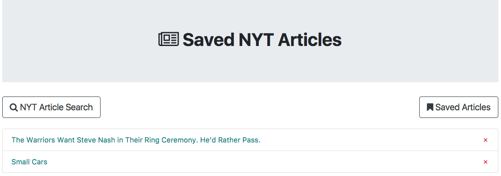

# NYT Article Scraper - react

This is an application that scrapes articles from the New York Times website and allows users to save them. It is built with React.js, a Node/Express server, and uses MongoDB to store the saved articles.

##Search for a topic, such as cars:

##Save the article, and see it saved on the saved page:

